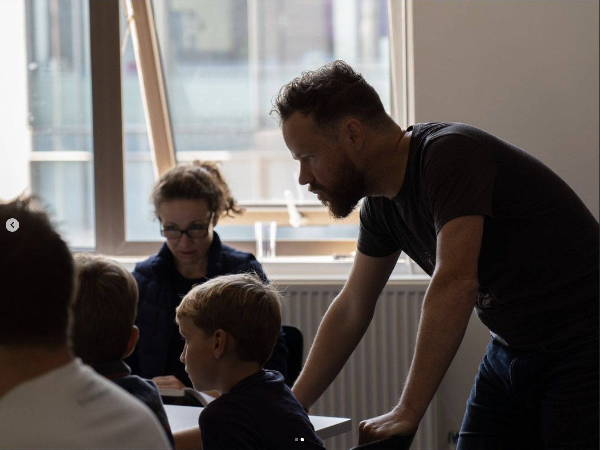


    







<!--   -->

Alongside performances, I frequently run **"Intro to Creative Coding"** and **"Creating Live Visuals for Music Performance"** workshops where young people and adults can have a first taste of using free software to create live reactive visuals, without having to write a line of code.

These workshops take a hands-on, dive-right-in approach to creative coding. From the very beginning, participants learn by doing, making [simple, visual, interactive scenes](https://www.youtube.com/watch?v=8PYaiNqd9DI) right away. Using the same [software](https://derivative.ca/) I use for my own live visuals, you'll make things spin, glow, warp, and sparkle as you learn about rendering, lighting, textures and more. 

_The workshop is suitable for anyone comfortable with basic computer skills, i.e. opening and saving files, typing, and using a mouse/trackpad._
  



**Workshop summary**
- This cross-disciplinary digital-making workshop takes a hands-on
approach, diving in to creating live animations with shapes that spin,
warp and pulse in response to music and sound. Working with a
node-based programming environment, students build a network of
operators to achieve their vision without writing a line of code.
Working in pairs, students take turns creating or actively observing in
order to maximise focus and learning.

**The Instructor**
- Charlie Hooper-Williams is an award-winning composer, pianist and
one of the software developers of the global top-10 app Shazam. His
performances as Larkhall combine piano with live-generated reactive
visuals, posing the question: **What if you could see music?** Having
achieved 250k streams, radio play on BBC Radio 3, Scala, Times
Radio as well as editorial support from Apple Music and Pandora,
Larkhall’s “vividly beautiful” “music to soothe the soul” is “unmissable… a must-see show”.

**Subjects**
- Computing
- Software Engineering
- Animation
- Music Technology
- IT
- Video Games
- Mathematics
- Design & Technology

**Participants**
- Up to 16 per session, usually working in pairs

**Length** 
- 120 min (60 min group instruction, 60 min exploration with
opportunity to ask questions)

**Requirements**
- One computer for every pair of students. 
- Pre-downloading, installing and registering the free software (instructions and link provided on registration). Software runs on MacOS and Windows.

**Prerequisites**
- Participants need basic computer skills (open/save a file, attach a
document to an email) but do NOT need prior coding experience.
- Students who have learned some coding already will find this a
change as we do not type any lines of code in the workshop.

**Outcomes**
- Finished audio-reactive scene (as shown at the top of this page)
which can be exported and shared
- Increased understanding of software engineering in a live context
- Confidence in picking up new technical skills
- Experience with digital storytelling
- Fun!



Download PDF brochure: [Intro to Creative Coding](https://s.disco.ac/jwxnipjocvke)

Download PDF brochure: [Creating Live Visuals for Music Performance](https://s.disco.ac/wrqihbokmvhu)











Otto is the name for my live visuals system. Because it listens and responds as I play, it feels more like playing with another person than following along to a machine; hence giving Otto a name. Otto's listening system is built in [Max/MSP](https://cycling74.com/products/max) using modules from IRCAM's [Antescofo](https://forum.ircam.fr/projects/detail/antescofo) project.

Otto and I create the visuals during my performances in [Touchdesigner](https://derivative.ca/), which is a programming system built specifically for this purpose.









 <!-- Overview -->
More information about this soon.









More information about this soon.









 

In recordings and live performances I use some effects pedals on the piano. 

First we have a tape delay simulator: [Strymon's _El Capistan_](https://www.strymon.net/), which gives a lovely warm analogue-sounding trail or echo on the piano sound.

From there we go into the [Microcosm by Hologram Electronics](https://www.hologramelectronics.com/microcosm). This brilliant pedal chops up the sound into thousands of small fragments each second, and uses those to make a granular cloud around the piano's sound. It intelligently adapts based on what I'm playing. If you hear the sound of a distant orchestra accompanying me while I play, it's probably this pedal.

Finally I use [Strymon's Big Sky](https://www.strymon.net/), which is one of the most powerful and flexible reverbs I've ever heard. It has shimmer and cloud effects that give an otherworldly, spacious sound to the piano.




