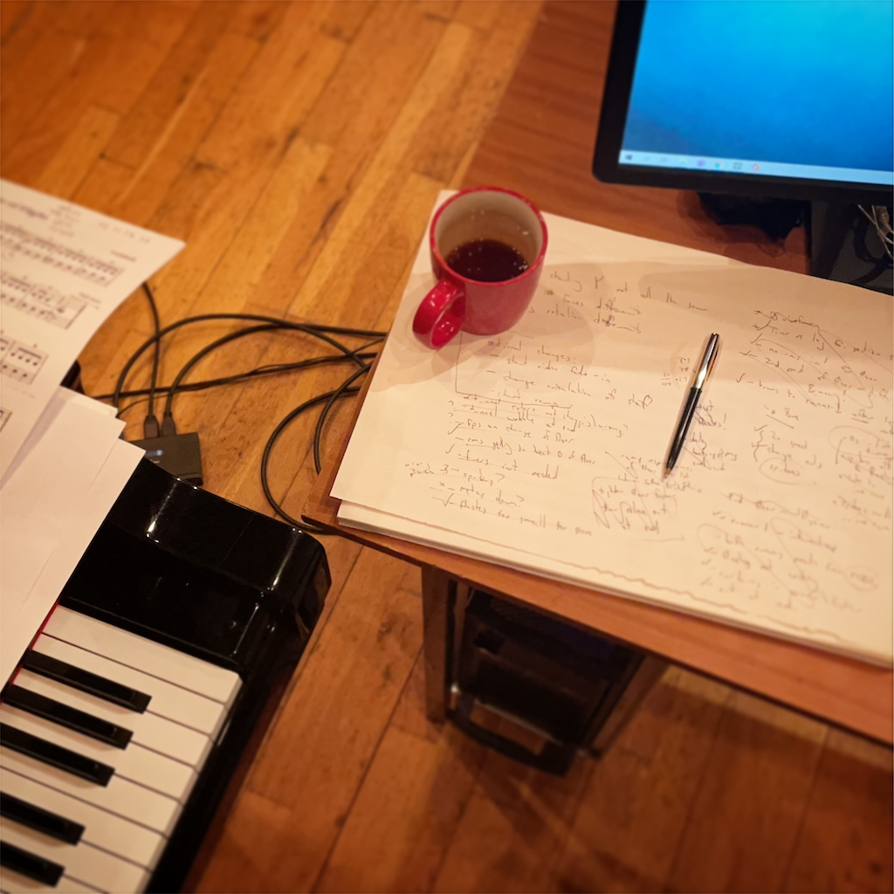
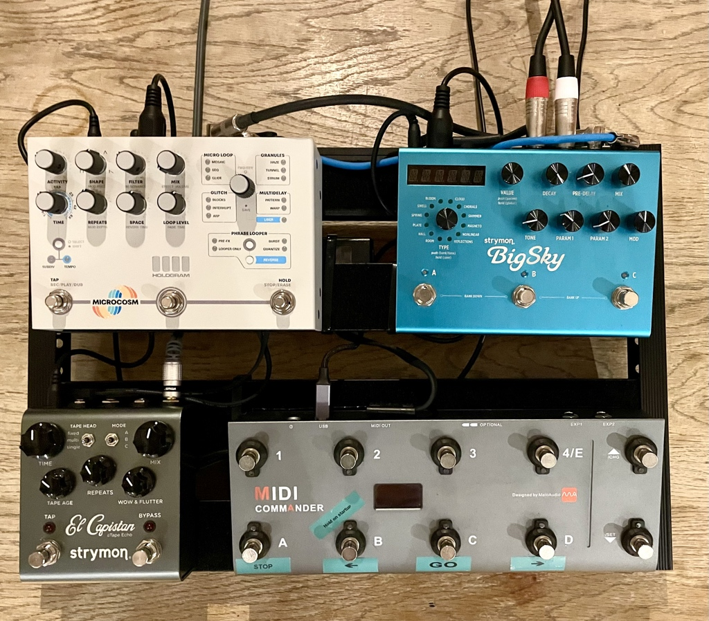


    








Otto is the name for my live visuals system. Because it listens and responds as I play, it feels more like playing with another person than following along to a machine; hence giving Otto a name. Otto's listening system is built in [Max/MSP](https://cycling74.com/products/max) using modules from IRCAM's [Antescofo](https://forum.ircam.fr/projects/detail/antescofo) project.

Physically speaking, if you're into specs, Otto is built with an AMD Ryzen 9 5900X 12-core 4.8GHz CPU and Nvidia 3060 GPU, on an Asus X570-Plus motherboard. He's got Noctua fans so he's nice and quiet during performances. 

Otto and I create the visuals during my performances in [Touchdesigner](https://derivative.ca/), which is a programming system built specifically for this purpose.









 <!-- Overview -->
More information about this soon.









More information about this soon.









 

Alongside performances, I frequently run "intro to creative coding" workshops where young people and adults can have a first taste of using free software to create live reactive visuals, without having to write a line of code.

These workshops take a hands-on, dive-right-in approach to creative coding. From the very beginning, participants learn by doing, making simple, visual, interactive scenes right away. Using the same software I use for my own live visuals, you'll make things spin, glow, warp, and sparkle as you learn about rendering, lighting, textures and more. 

_The workshop is suitable for anyone comfortable with basic computer skills, i.e. opening and saving files, typing, and using a mouse/trackpad._









 

In recordings and live performances I use some effects pedals on the piano. 

First we have a tape delay simulator: [Strymon's _El Capistan_](https://www.strymon.net/), which gives a lovely warm analogue-sounding trail or echo on the piano sound.

From there we go into the [Microcosm by Hologram Electronics](https://www.hologramelectronics.com/microcosm). This brilliant pedal chops up the sound into thousands of small fragments each second, and uses those to make a granular cloud around the piano's sound. It intelligently adapts based on what I'm playing. If you hear the sound of a distant orchestra accompanying me while I play, it's probably this pedal.

Finally I use [Strymon's Big Sky](https://www.strymon.net/), which is one of the most powerful and flexible reverbs I've ever heard. It has shimmer and cloud effects that give an otherworldly, spacious sound to the piano.




